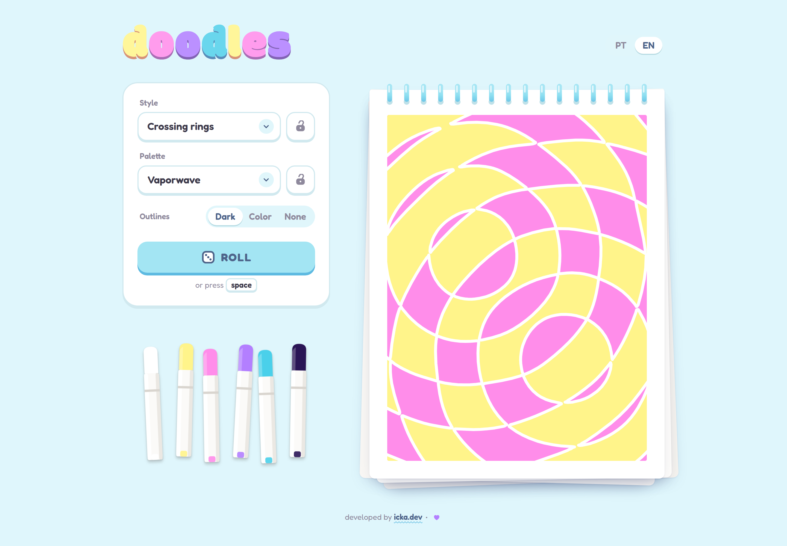

# Doodles

A doodle page idea generator for sketchbooks. Roll a style, a color palette and a motif, and get a sketch drawn on the fly to use as a starting point.

**Live demo:** [doodles.vercel.app](https://doodles.vercel.app)



## Why

I use art as therapy, and some days I don't want to spend energy deciding what to draw. Doodles gives me a reference of colors and shapes to borrow from, so I can just sit down and draw.

## Features

- **17 styles**: op art, pop art, groovy checkerboards, 3D lines, flower tiles, hatched patchwork and more
- **29 color palettes**, each one shown as a set of markers next to the page
- **Procedural SVG sketches**: every roll draws a new page from a seeded random generator, with no image assets
- **Lock or pick**: keep the style or the palette you like and roll only the rest
- **Outline modes**: dark, colored or no outlines
- **Adaptive theme**: the interface colors follow the current palette
- **Keyboard friendly**: press `Space` to roll
- **Bilingual**: Portuguese and English, detected from the browser language

## Tech stack

- [Svelte 5](https://svelte.dev) (runes)
- TypeScript
- [Vite](https://vite.dev)
- Plain CSS with custom properties and `color-mix()`

## Getting started

```bash
npm install
npm run dev
```

| Command           | Description                         |
| ----------------- | ----------------------------------- |
| `npm run dev`     | Start the dev server                |
| `npm run build`   | Build the static site into `dist/`  |
| `npm run preview` | Serve the `dist/` build locally     |
| `npm run check`   | Run type checking with svelte-check |

## Project structure

```
src/
├── components/   UI components (picker, notepad, markers, page flip)
└── lib/
    ├── art/      SVG drawing engine and one renderer per style
    ├── data/     Style catalog, palettes and motifs
    └── ...       Generator, seeded random, geometry, i18n, theme
```

## License

[MIT](LICENSE)
